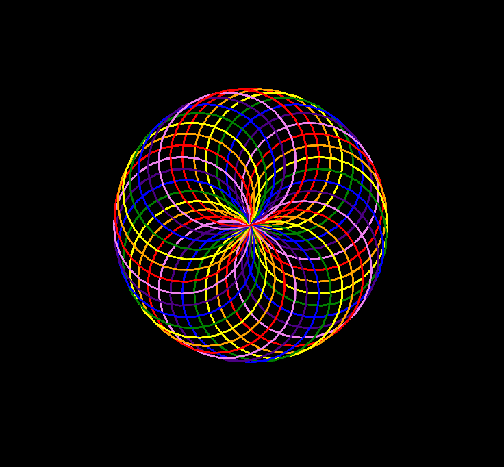

A repository providing build versions of `skulpt-stdlib.js` and `skulpt.min.js` for easy integration via CDN.

### Usage

To include Skulpt in your HTML, add the following script tags:

```html
  <script src="https://cdn.jsdelivr.net/gh/Tezumie/Skulpt-CDN@latest/skulpt.min.js"></script>
  <script src="https://cdn.jsdelivr.net/gh/Tezumie/Skulpt-CDN@latest/skulpt-stdlib.js"></script>
```

### Example

Refer to index.html and script.py in this repository to see how to run a Python file in a browser using Skulpt.

### Live Demo

You can view and run this project instantly in the aijs.io browser editor:

Run in aijs.io:

https://aijs.io/editor?user=Tezumie&project=python_Skulpt


### Skulpt

https://github.com/skulpt/skulpt
